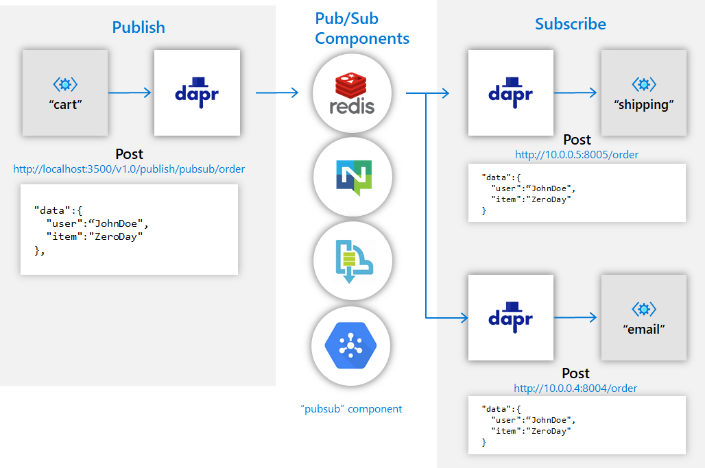

# Assignment 3 - Add pub/sub messaging

In this assignment, you're going to add Dapr **publish/subscribe** messaging to send messages from the TrafficControlService to the FineCollectionService.

## Dapr pub/sub building block

In assignment 2, you implemented direct, synchronous communication between two microservices. This pattern is common when an immediate response is required. Communication between service doesn't always require an immediate response.

The publish/subscribe pattern allows your microservices to communicate asynchronously with each other purely by sending messages. In this system, the producer of a message sends it to a topic, with no knowledge of what service(s) will consume the message. A message can even be sent if there's no consumer for it.

Similarly, a subscriber, or consumer, will receive messages from a topic without knowledge of what producer sent it. This pattern is especially useful when you need to decouple microservices from one another. See the diagram below for an overview of how this pattern works with Dapr:

Note how different pub/sub components (concrete providers) can be configured for the building block to consume.

 > For more detailed information on the pub/sub building block, read the [overview of this building block](https://docs.dapr.io/developing-applications/building-blocks/pubsub/pubsub-overview/) in the Dapr documentation. 

 > For more detailed information on messaging in microservice applications, read the service-to-service communication section in the [Architecting Cloud Native .NET Apps for Azure](https://docs.microsoft.com/dotnet/architecture/cloud-native/service-to-service-communication) guidance eBook.

## Assignment goals

To complete this assignment, you must reach the following goals:

1. The TrafficControlService sends `SpeedingViolation` messages using the Dapr pub/sub building block.
1. The FineCollectionService receives `SpeedingViolation` messages using the Dapr pub/sub building block.
1. RabbitMQ will be used as pub/sub message broker that runs as part of the solution in a Docker container.
1. Azure Service Bus can be substituted as a message broker without code changes.

This assignment targets the operations labeled as **number 2** in the end-state setup:

## DIY instructions

First open the `src` folder in this repo in VS Code. Then open the [Dapr documentation for publish / subscribe](https://github.com/dapr/docs) and start hacking away. Make sure you use the RabbitMQ pub/sub component and spin up a RabbitMQ container to act as message broker.

## Step by step instructions

To get step-by-step instructions to achieve the goals, open the [step-by-step instructions](step-by-step.md).

## Next assignment

You've now completed this assignment. 

Make sure you stop all running processes and close all the terminal windows in VS Code before proceeding to the next assignment.

Go to [assignment 4](../Assignment04/README.md).
