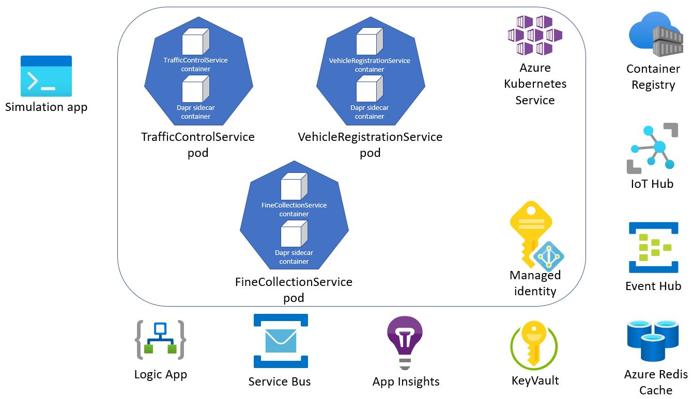

# Assignment 8 - Deploy to Azure Kubernetes Service (AKS)

In this assignment, you're going to deploy the Dapr-enabled services you have written locally to an [Azure Kubernetes Service (AKS)](https://docs.microsoft.com/en-us/azure/aks/) cluster.



## Assignment goals

To complete this assignment, you must reach the following goals:

- Successfully deploy all 3 services (VehicleRegistrationService, TrafficControlService & FineCollectionService) to an AKS cluster.
- Successfully run the Simulation service locally that connects to your AKS-hosted services

## Step 1: Update all port numbers

By default, Dapr sidecars run on port 3500 when deployed to AKS. This means you will need to change the port numbers in the FineCollectionService & TrafficControlService to port 3500 for the calls to Dapr.

- src/FineCollectionService/Proxies/VehicleRegistrationService.cs
- src/TrafficControlService/Controllers/TrafficController.cs

## Step 2: Build container images for each service & upload to Azure Container Registry

You will need to build these services, create a Docker container image that has this source code baked into it and then upload
to an Azure Container Registry. The easiest way to do that is to use [ACR tasks](https://docs.microsoft.com/en-us/azure/container-registry/container-registry-tasks-overview).

1. 	Navigate to the src/VehicleRegistrationService directory & use the Azure Container Registry task to build your image from source.

    ```shell
    az acr build --registry <container-registry-name> --image vehicleregistrationservice:assignment08 .
    ```

1. 	Navigate to the src/TrafficControlService directory & use the Azure Container Registry task to build your image from source.

    ```shell
    az acr build --registry <container-registry-name> --image trafficcontrolservice:assignment08 .
    ```

1. 	Navigate to the src/FineCollectionService directory & use the Azure Container Registry task to build your image from source.
  
    ```shell
    az acr build --registry <container-registry-name> --image trafficcontrolservice:assignment08 .		
    ```

## Step 3: Deploy container images to Azure Kubernetes Service

Now that your container images have been uploaded to the Azure Container Registry, you can deploy these images to your Azure
Kubernetes Service. Deployment spec files have been added to each service to make this easier. You will need to customize them
to reference your container registry path & AKS ingress.

1.	Open the `src/FineCollectionService/deploy/deploy.yaml` file and update the container registry name to be the one you have deployed.

    ```yaml
    spec:
      containers:
      - name: finecollectionservice
        image: <container-registry-name>.azurecr.io/finecollectionservice:assignment08
    ```

1.	Modify the ingress host to match your AKS instance's HTTP application routing domain. You can query for this if you don't have it.

    ```shell
    az aks show --resource-group <resource-group-name> --name <aks-name> --query="addonProfiles.httpApplicationRouting.config.HTTPApplicationRoutingZoneName"
    ```

    ```shell
    "e13e6fb6d2534a41ae60.southcentralus.aksapp.io"
    ```

    ```yaml
    spec:
    rules:
    - host: finecollectionservice.<aks-http-application-routing-zone-name>
    ```
    
    Repeat these steps for the `TrafficControlService` and the `VehicleRegistrationService`.

1. 	Deploy your new services to AKS. From the root of each service's application code directory, run the following.

    ```shell
    kubectl apply -f ./deploy/deploy.yaml
    ```

    Repeat these steps for the `TrafficControlService` and the `VehicleRegistrationService`.

1.	Verify your services are running (it may take a little while for all the services to finish starting up). You may see
		a few different pods running in the default namespace in addition to your services (and the unique identifiers on the
		end of the services will be different).

    ```shell
    kubectl get pods
    ```

    ```shell
    NAME                                          READY   STATUS             RESTARTS   AGE  
    finecollectionservice-7f76f68547-d98gc        2/2     Running            0          4d18h
    trafficcontrolservice-749ffcf4bb-crx54        2/2     Running            0          4d19h
    vehicleregistrationservice-65c9cf6cdc-s7c4s   2/2     Running            0          4d19h
    ```

## Step 4: Run Simulation application

Run the Simluation service, which writes to your IoT Hub's MQTT queue. You will begin to see fines get emailed to you as
appropriate.