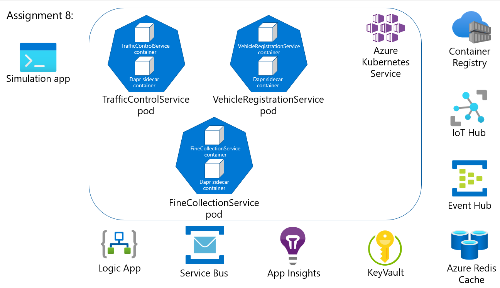

# Assignment 8 - Deploy to Azure Kubernetes Service (AKS)

In this assignment, you're going to deploy the Dapr-enabled services you have written locally to an [Azure Kubernetes Service (AKS)](https://docs.microsoft.com/en-us/azure/aks/) cluster.



## Assignment goals

To complete this assignment, you must reach the following goals:

- Successfully deploy all 3 services (VehicleRegistrationService, TrafficControlService & FineCollectionService) to an AKS cluster.
- Successfully run the Simulation service locally that connects to your AKS-hosted services

## Step 1: Update all port numbers

By default, Dapr sidecars run on port 3500 when deployed to AKS. This means you will need to change the port numbers in the FineCollectionService & TrafficControlService to port 3500 for the calls to Dapr.

- src/FineCollectionService/Proxies/VehicleRegistrationService.cs
- src/TrafficControlService/Controllers/TrafficController.cs

## Step 2: Update the Dapr secrets configuration file to pull secrets from Azure KeyVault in AKS

> Note: This assumes you have already downloaded the certificate PFX file from Assignment 7.

1.  Create the Kubernetes namespace for all the services to live under.

    ```shell
    kubectl create namespace dapr-trafficcontrol
    ```

1.  Set the default Kubernetes namespace for all future `kubectl` commands.

    ```shell
    kubectl config set-context --current --namespace=dapr-trafficcontrol
    ```

1.  Create a Kubernetes secret.

    ```shell
    kubectl create secret generic "<service-principal-name>" --from-file="<service-principal-name>"="<pfx-certificate-file-fully-qualified-local-path>" -n dapr-trafficcontrol
    ```

1.  Update the ```src/dapr/components/secrets-file.yaml``` with the Azure KeyVault configuration values. You will need to customize the **KeyVault name**, **tenant ID**, **client ID**, **resource ID**.

    ```yaml
    apiVersion: dapr.io/v1alpha1
    kind: Component
    metadata:
      name: trafficcontrol-secrets
    spec:
      type: secretstores.azure.keyvault
      version: v1
      metadata:
      - name: vaultName
        value: kv-dapr-ussc-demo
      - name: spnTenantId
        value: 72f988bf-86f1-41af-91ab-2d7cd011db47
      - name: spnClientId
        value: 1d62c4a7-287d-47ec-9e31-6c9c382ed0d2
      - name: spnCertificate
        secretKeyRef:
          name: sp-dapr-workshop-ussc-demo
          key: sp-dapr-workshop-ussc-demo
      - name: nestedSeparator
        value: "-"
    scopes:
    - finecollectionservice   
    auth:
      secretStore: kubernetes

## Step 3: Build container images for each service & upload to Azure Container Registry

You will need to build these services, create a Docker container image that has this source code baked into it and then upload to an Azure Container Registry. The easiest way to do that is to use [ACR tasks](https://docs.microsoft.com/en-us/azure/container-registry/container-registry-tasks-overview).

1. 	Navigate to the `src/VehicleRegistrationService` directory & use the Azure Container Registry task to build your image from source.

    ```shell
    az acr build --registry <container-registry-name> --image vehicleregistrationservice:assignment08 .
    ```

1. 	Navigate to the `src/TrafficControlService` directory & use the Azure Container Registry task to build your image from source.

    ```shell
    az acr build --registry <container-registry-name> --image trafficcontrolservice:assignment08 .
    ```

1. 	Navigate to the `src/FineCollectionService` directory & use the Azure Container Registry task to build your image from source.
  
    ```shell
    az acr build --registry <container-registry-name> --image trafficcontrolservice:assignment08 .		
    ```

## Step 4: Deploy container images to Azure Kubernetes Service

Now that your container images have been uploaded to the Azure Container Registry, you can deploy these images to your Azure Kubernetes Service. Deployment spec files have been added to each service to make this easier. You will need to customize them to reference your container registry path & AKS ingress.

1.	Open the `src/k8s/components/fine-collection-service.yaml` file and update the container registry name to be the one you have deployed.

    ```yaml
    spec:
      containers:
      - name: finecollectionservice
        image: <container-registry-name>.azurecr.io/finecollectionservice:assignment08
    ```

1.	Modify the ingress host to match your AKS instance's HTTP application routing domain. You can query for this if you don't have it.

    ```shell
    az aks show --resource-group <resource-group-name> --name <aks-name> --query="addonProfiles.httpApplicationRouting.config.HTTPApplicationRoutingZoneName"
    ```

    ```shell
    "e13e6fb6d2534a41ae60.southcentralus.aksapp.io"
    ```

    ```yaml
    spec:
    rules:
    - host: finecollectionservice.<aks-http-application-routing-zone-name>
    ```
    
1.  Repeat these steps for the `TrafficControlService` and the `VehicleRegistrationService`.

1. 	Deploy your new services to AKS. Navigate to the `src/k8s/components` directory and run the following:

    ```shell
    cd src/dapr/components
    kubectl apply -k .
    ```

1.	Verify your services are running (it may take a little while for all the services to finish starting up). Make sure the **READY** status for all pods says `2/2`.

    ```shell
    kubectl get pods
    ```

    ```shell
    NAME                                           READY   STATUS    RESTARTS   AGE
    fine-collection-service-55c7bfcf64-kqfvf       2/2     Running   0          11s
    traffic-control-service-64dc9cb676-2lcbz       2/2     Running   0          11s
    vehicle-registration-service-dd6fbbbc6-qvt4p   2/2     Running   0          11s
    zipkin-f5c696fb7-ns65k                         1/1     Running   0          11s
    ```

    If you pods are not running (their status is `CrashLoopBackOff`), you will need to look into the pod logs to see what is wrong.

    Remember, there are 2 containers in each pod, the actual service container & the `daprd` container.

    Example:

    ```shell
    kubectl logs vehicle-registration-service-dd6fbbbc6-sxt4z vehicle-registration-service
    
    kubectl logs vehicle-registration-service-dd6fbbbc6-sxt4z daprd
    ```

## Step 7: Run Simulation application

Run the Simluation service, which writes to your IoT Hub's MQTT queue. You will begin to see fines get emailed to you as appropriate.

## Security note

To make this example as accesible as possible, SAS tokens and default AKS security settings are in place. In a production environment, a more secure option is to use managed identities for the various services to talk to each other in Azure (for instance, allowing Azure Kubernetes Service to pull from Azure Container Registry) & [AKS security baseline](https://github.com/mspnp/aks-fabrikam-dronedelivery).

## Final solution

You have reached the end of the hands-on assignments. If you haven't been able to do all the assignments, go to this [this repository](https://github.com/edwinvw/dapr-traffic-control) for the end result.

Thanks for participating in these hands-on assignments! Hopefully you've learned about Dapr and how to use it. Obviously, these assignment barely scratch the surface of what is possible with Dapr. We have not touched upon subjects like: hardening production environments, actors, integration with Azure Functions, Azure API Management and Azure Logic Apps just to name a few. So if you're interested in learning more, I suggest you read the [Dapr documentation](https://docs.dapr.io).