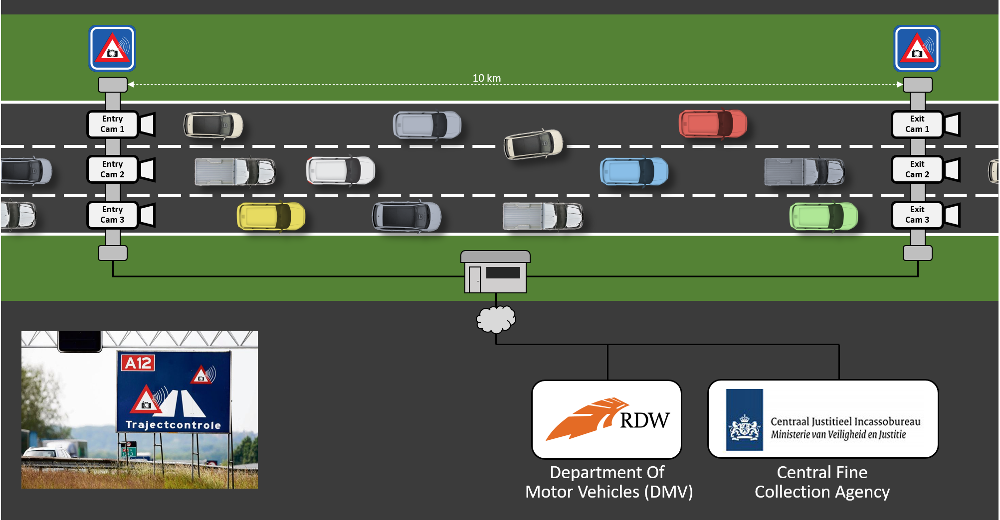
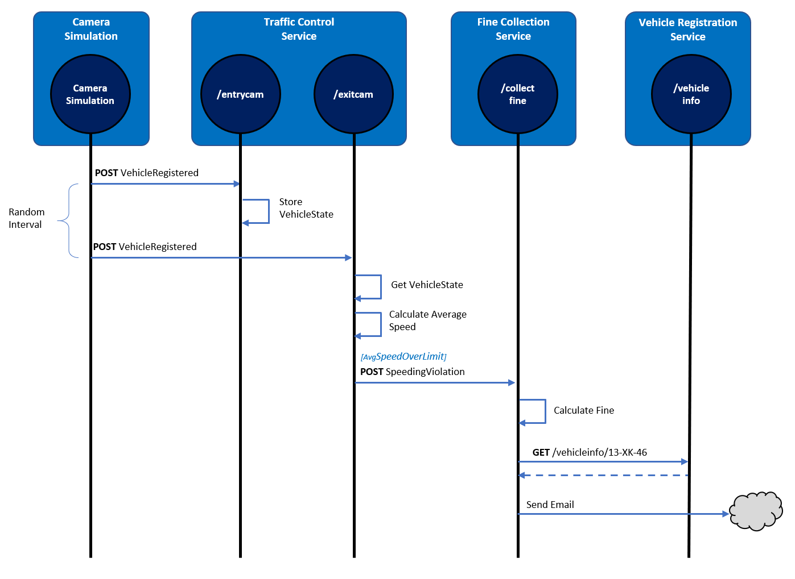
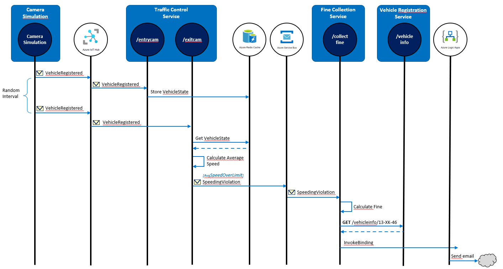

# Dapr on Azure hands-on

This repository contains several hands-on assignments that will introduce you to Dapr. You will start with a simple ASP.NET Core application that is composed of several microservices. In each assignment, you'll enhance the the application by adding Dapr building blocks and components. At the same time, you'll configure the application to consume Azure-based [backing services](https://docs.microsoft.com/dotnet/architecture/cloud-native/definition#backing-services). When complete, you'll have implemented the following Dapr building blocks:

- Service invocation
- State-management
- Publish / Subscribe
- Bindings
- Secrets management

As Dapr can run on a variety of hosts, you'll start by running Dapr in *self-hosted mode* on your computer. Then, you'll deploy the application to run Dapr in Azure Kubernetes Service.

## The domain

The assignments implement a traffic-control camera system that are found on Dutch highways. Here's how the simulation works:

There's 1 entry-camera and 1 exit-camera per lane. When a car passes an entry-camera, a photo of the license plate is taken and the car and the timestamp is registered.

When the car passes an exit-camera, another photo and timestamp are registered. The system then calculates the average speed of the car based on the entry- and exit-timestamp. If a speeding violation is detected, a message is sent to the Central Fine Collection Agency (or CJIB in Dutch). The system retrieves the vehicle information and the vehicle owner is sent a notice for a fine.

### Architecture

The traffic-control application architecture consists of four microservices:

- The **Camera Simulation** is a .NET Core console application that will simulate passing cars.
- The **Traffic Control Service** is an ASP.NET Core WebAPI application that offers entry and exit endpoints: `/entrycam` and `/exitcam`.
- The **Fine Collection Service** is an ASP.NET Core WebAPI application that offers 1 endpoint: `/collectfine` for collecting fines.
- The **Vehicle Registration Service** is an ASP.NET Core WebAPI application that offers 1 endpoint: `/getvehicleinfo/{license-number}` for retrieving vehicle- and owner-information of a vehicle.

These services compose together to simulate a traffic control scenario.

The following sequence diagram describes how the application works:

1. The Camera Simulation generates a random license plate number and sends a *VehicleRegistered* message (containing this license plate number, a random entry-lane (1-3) and the timestamp) to the `/entrycam` endpoint of the TrafficControlService.
1. The TrafficControlService stores the *VehicleState* (license plate number and entry-timestamp).
1. After a random interval, the Camera Simulation sends a follow-up *VehicleRegistered* message to the `/exitcam` endpoint of the TrafficControlService. It contains the license plate number generated in step 1, a random exit-lane (1-3), and the exit timestamp.
1. The TrafficControlService retrieves the *VehicleState* that was stored at vehicle entry.
1. The TrafficControlService calculates the average speed of the vehicle using the entry- and exit-timestamp. It also stores the *VehicleState* with the exit timestamp for audit purposes, which is left out of the sequence diagram for clarity.
1. If the average speed is above the speed-limit, the TrafficControlService calls the `/collectfine` endpoint of the FineCollectionService. The request payload will be a *SpeedingViolation* containing the license plate number of the vehicle, the identifier of the road, the speeding-violation in KMh, and the timestamp of the violation.
1. The FineCollectionService calculates the fine for the speeding-violation.
1. The FineCollectionSerivice calls the `/vehicleinfo/{license-number}` endpoint of the VehicleRegistrationService with the license plate number of the speeding vehicle to retrieve its vehicle- and owner-information.
1. The FineCollectionService sends a fine notice to the owner of the vehicle by email.

All actions described in the sequence are logged to the console during execution so you can follow the flow.

The `src` folder in the repo contains the starting-point for the workshop. It contains a version of the services that use plain HTTP communication and store state in memory. With each workshop assignment, you'll add a Dapr building block to enhance this application architecture.

> [!IMPORTANT]
> It's important to understand that all calls between services are direct, synchronous HTTP calls using the HttpClient library in .NET Core. While sometimes necessary, this type of synchronous communication [isn't considered a best practice](https://docs.microsoft.com/dotnet/architecture/cloud-native/service-to-service-communication#requestresponse-messaging) for distributed microservice applications. When possible, you should consider decoupling microservices using asynchronous messaging. However, decoupling communication can dramatically increase the architectural and operational complexity of an application. You'll soon see how Dapr reduces the inherent complexity of distributed microservice applications.

### End-state with Dapr applied

As you complete the lab assignments, you'll evolve the application architecture to work with Dapr and consume Azure-based backing services:

- Azure IoT Hub
- Azure Redis Cache
- Azure Service Bus
- Azure Logic Apps
- Azure Key Vault

The following diagram shows the end-state of the application:

1. For synchronous request/response communication between the FineCollectionService and VehicleRegistrationService to retrieve driver information, you'll implement the Dapr **service invocation** building block.
1. To send speeding violations to the FineCollectionService, you'll implement the Dapr **publish and subscribe** building block (asynchronous communication) with the Dapr Azure Service Bus component.
1. To store vehicle state, you'll implement the Dapr **state management** building block with the Dapr Azure Redis Cache component.
1. To send fine notices to the owner of a speeding vehicle by email. You'll implement the HTTP **output binding** building block with the Dapr Azure Logic App component.
1. To send car info to the TrafficControlService, you'll use the Dapr **input binding** for MQTT using Dapr Azure IoT Hub component as the MQTT broker.
1. To retrieve a license key for a fine calculator component and credentials for connecting to the smtp server, you'll implement the Dapr **secrets management** building block with Dapr Azure Key Vault component.

The following sequence diagram shows how the solution will work after implementing Dapr:

> [!NOTE]
> It's helpful to refer back to preceding sequence diagram as you progress through the workshop assignments.

## Getting started with the workshop

### Instructions

You'll find each assignment along with a description in separate folders in this repo. The `src` folder contains the code for the workshop.

> [!IMPORTANT]
> It is important you work through all the assignments in order and don't skip any assignments. The instructions and code for each subsequent assignment builds on top of the completed previous assignments.

The description for each assignment (accept the first one) contains *two approaches* for completing the tasks: A **DIY** or a **step-by-step** option. The DIY option states the outcome you need to achieve and provides no further instruction. It's entirely up to you to achieve the goals with the help of the Dapr documentation. The step-by-step option describes exactly what you need to change in the application step-by-step. It's up to you to pick an approach. If you pick the DIY approach and get stuck, you can always go to the step-by-step approach for some help.

#### Integrated terminal

It's recommended that you use a single instance of VS Code for the development work for the workshop. You'll use the integrated terminal in VS Code extensively. All terminal commands have been tested on a Windows machine with the integrated Bash terminal in VS Code. If you have any issues with the commands on Linux or Mac, please create an issue or a PR to add the appropriate command.

> [!NOTE]
> Optionally, you may want to install the free [Typora](https://typora.io/) markdown application to read the lab instructions while using VS Code for your development work.

#### Prevent port collisions

During the workshop, you'll run the microservices in the solution on your local machine. To prevent port-collisions, all services will listen on a different HTTP port. When running with Dapr, you need additional ports for HTTP and gRPC communication between the sidecar services. By default, these ports are `3500` and `50001`. However, you'll use different port numbers for each service to prevent port collisions. Please closely follow the instructions so that your microservices use the following ports for their Dapr sidecars:

| Service                    | Application Port | Dapr sidecar HTTP port | Dapr sidecar gRPC port |
| -------------------------- | ---------------- | ---------------------- | ---------------------- |
| TrafficControlService      | 6000             | 3600                   | 60000                  |
| FineCollectionService      | 6001             | 3601                   | 60001                  |
| VehicleRegistrationService | 6002             | 3602                   | 60002                  |

Use the ports specified in the preceding table *whether* using the DIY or step-by-step approach.

You'll specify the ports from the command-line when starting a service with the Dapr CLI using the following command-line arguments:

- `--app-port`
- `--dapr-http-port`
- `--dapr-grpc-port`

#### Kudos to the originators

Before we start, please give a big round of applause to original authors of this workshop:

Both Edwin and Sander are Principal Architects at InfoSupport in the Netherlands. Both are Microsoft MVPs, avid community presenters, and co-authors of the Microsoft eBook [Dapr for .NET Developers](https://docs.microsoft.com/dotnet/architecture/dapr-for-net-developers/).

### Ready?

Go to [assignment 0](Assignment0/README.md).